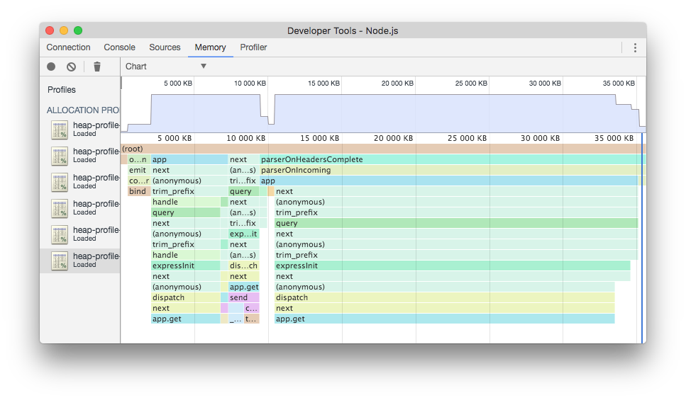

# Sampling Heap Profiler

[![style badge][gts-image]][gts-url]
[](https://circleci.com/gh/v8/sampling-heap-profiler)

This module adds supports for the Sampling Heap Profiler in V8.
This works by taking a random sample of objects, as they are allocated, to keep
a statistical sample of what is live in the heap at any given time. This also
keeps track of the stack that allocated a given sampled object. This means that
you know not only what is live, but what code path allocated it. This is
motivated by, and functions similarly to, the heap profiler built into tcmalloc.

* This is supposed to be lightweight enough for in-production use on servers.
* The generated snapshots can be saved offline, and be opened in DevTools later.



## Usage

```javascript
const heapProfile = require('heap-profile');

heapProfile.start();

// Write a snapshot to disk every hour
setInterval(() => {
  heapProfile.write((err, filename) => {
    console.log(`heapProfile.write. err: ${err} filename: ${filename}`);
  });
}, 60 * 60 * 1000).unref();
```

### heapProfile.start()

Starts sampling. You probably want to call this as close to the program startup
as possible.

### heapProfile.get(translate?: boolean)

Returns the profile composed of a tree of nodes (V8 format). When the optional
parameter `translate` is true, the returned profile is in DevTools format.

### heapProfile.write()

This function is overloaded with the following variants:

```ts
function write(): Promise<string>;
function write(path: string): Promise<string>;
function write(cb: Callback): void;
function write(path: string, cb: Callback): void;

interface Callback { (err: Error|null, path?: string): void; }
```


Writes the current heap sample to the path specified. If the path parameter is
omitted, a file with the pattern `heap-profile-${Date.now()}.heapprofile` will
be written to the current working directory.

The callback returns error if profiling was not active at the time of call.
Otherwise the output file path is returned via the callback or the promise.

### stop()

Stops sampling and discard the current set of tracked sampled objects. You can
call `start` again to start sampling again, but any objects allocated before
`start` is called cannot be sampled, which means that the profile will not
be representative of the state of the heap.

The sampling overhead is low enough that you probably don't need to use `stop`.


[gts-image]: https://img.shields.io/badge/code%20style-Google-blue.svg
[gts-url]: https://www.npmjs.com/package/gts

